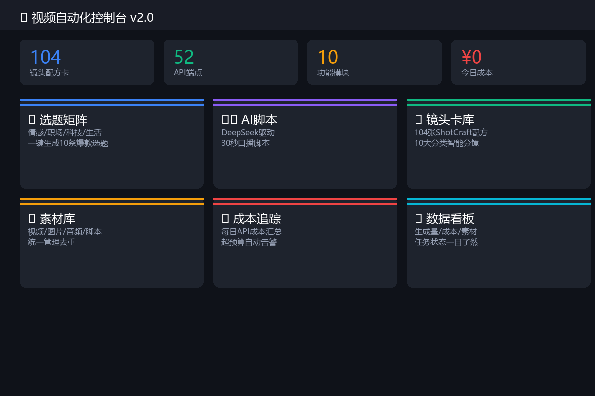
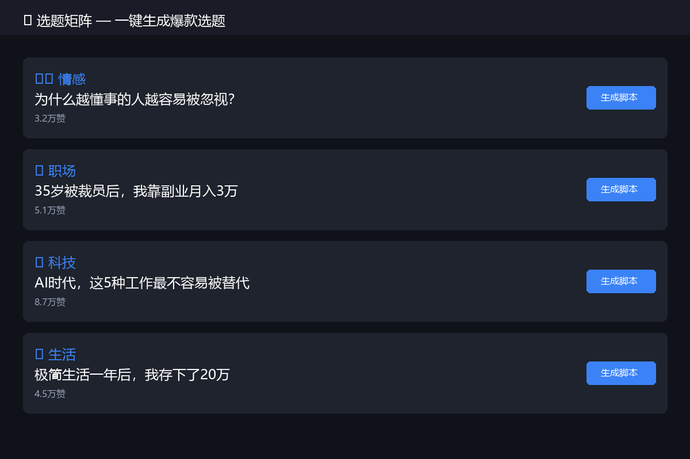
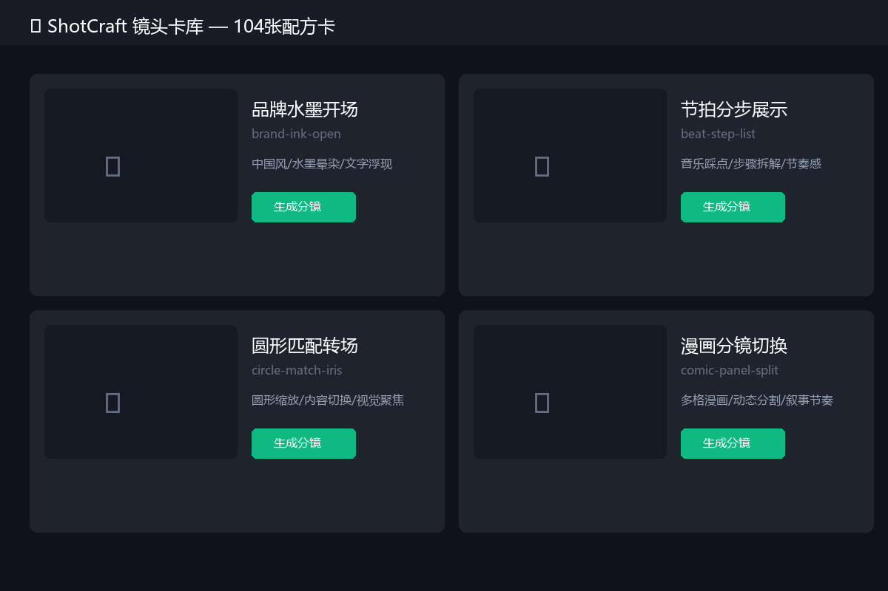
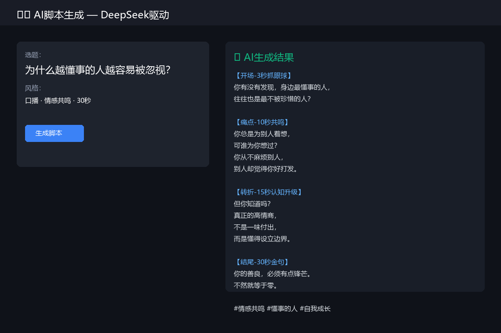
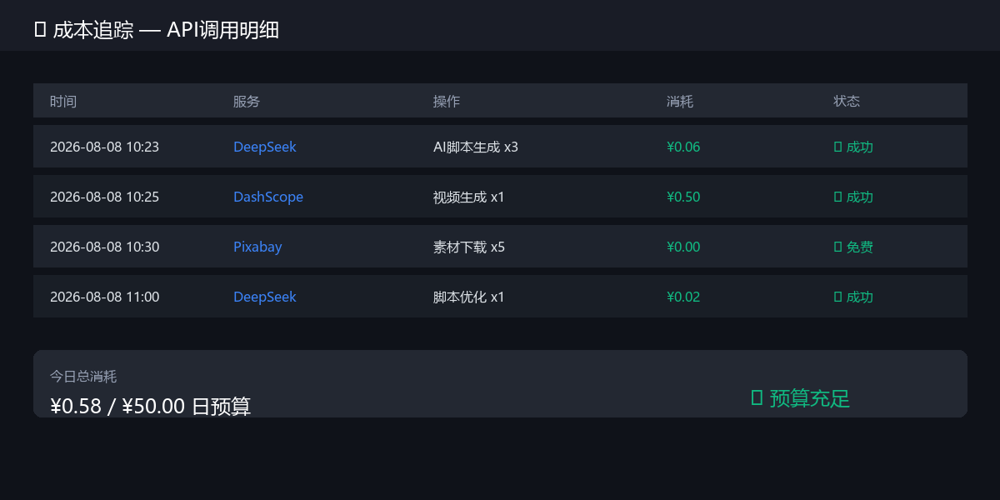

# VideoForge 🎬 — 一句话出片的 AI 视频工作台

[](https://github.com/yao-wen-jie/VideoForge/stargazers)
[](LICENSE)
[](https://www.python.org)

> **选题 → AI脚本 → 镜头卡分镜 → AI配音 → 素材管理，全流程自动化。**
>
> 整合 104 张 ShotCraft 镜头配方卡 + 11 种 AI 配音音色，双击即用，开箱出片。

[📺 B站演示](https://space.bilibili.com) · [📖 使用文档](SKILL.md) · [💬 讨论区](https://github.com/yao-wen-jie/VideoForge/issues)

---

## ✨ 为什么选 VideoForge？

| 痛点 | 传统方式 | VideoForge |
|:---|:---|:---|
| 想选题 | 刷2小时抖音找灵感 | 一键生成 10 条带 hook 的选题 |
| 写脚本 | 憋1小时写不出 | 30 秒生成完整口播稿 |
| 做分镜 | 凭感觉拍，剪完才发现节奏不对 | 104 张镜头卡自动匹配分镜 |
| 配声音 | 自己录 10 遍都不满意 | 输入文案，AI 一键配音 |
| 管素材 | 文件夹乱成一锅粥 | 统一库 + 自动去重 |

**一句话：你只管想主题，剩下的交给 VideoForge。**

---

## 🚀 30 秒上手

### Windows（推荐）

```bash
# 1. 下载项目，解压到桌面
cd VideoForge

# 2. 双击启动
start.bat
```

服务启动后**自动打开浏览器** → `http://localhost:5000`

### macOS / Linux

```bash
git clone https://github.com/yao-wen-jie/VideoForge.git
cd VideoForge
python -m venv .venv
source .venv/bin/activate  # Windows: .venv\Scripts\activate
pip install -r requirements.txt
python app.py
```

---

## 🎬 功能一览

### 1. 选题矩阵 — 3 秒出 10 条爆款选题
输入分类（情感/职场/科技/生活），一键生成带 hook、痛点、优先级的选题列表。

### 2. AI 脚本 — DeepSeek 驱动口播稿
输入选题标题，30 秒生成黄金五段式结构口播脚本（开场钩子→痛点→方案→案例→行动指令）。

### 3. ShotCraft 镜头卡库 — 104 张配方卡
每张卡片包含：镜头类型、运镜方式、参考样片、适用场景、时长建议。搜索即得，自动生成分镜排期。

### 4. AI 配音 — 11 种音色，一键生成
输入文案，选择声音（晓晓/云希/云健等），一键合成 MP3。支持语速调节。

### 5. 素材库 — 去重 + 统一管理
视频/图片/音频/脚本统一管理，支持视频指纹去重检测。

### 6. 数据看板 — 一目了然
生成量、成本、任务状态、素材统计，全部可视化。

---

## 📸 界面预览

| 首页控制台 | 选题矩阵 | 镜头卡库 |
|:---:|:---:|:---:|
|  |  |  |

| AI脚本生成 | AI配音 | 数据看板 |
|:---:|:---:|:---:|
|  |  |  |

---

## ⚡ 快速演示

```bash
# 启动服务
start.bat

# 浏览器打开 http://localhost:5000
# 1. 点 "选题矩阵" → 选"情感" → 生成 → 获得10条选题
# 2. 点 "AI脚本" → 粘贴选题 → 生成脚本
# 3. 点 "AI配音" → 粘贴脚本 → 选"晓晓" → 一键生成语音
# 4. 下载音频，配合镜头卡开拍
```

**全程不超过 5 分钟。**

---

## 🔧 配置 API Key（解锁 AI 功能）

打开 `http://localhost:5000` → 「系统设置」：

| Key | 用途 | 获取方式 | 是否必须 |
|-----|------|----------|:-------:|
| `deepseek` | AI 脚本生成 | [硅基流动](https://www.siliconflow.cn) 免费注册领额度 | ⭐ 最低配置 |
| `pixabay` | 免费素材 | [Pixabay API](https://pixabay.com/api/docs/) | 可选 |
| `pexels` | 免费素材 | [Pexels API](https://www.pexels.com/api/) | 可选 |

> 只配 `deepseek` 就能用 AI 脚本生成，硅基流动注册送免费额度，个人使用足够。

---

## 📁 项目结构

```
VideoForge/
├── app.py                 # Flask 主应用
├── start.bat              # 一键启动（Windows）
├── README.md              # 本文档
├── SKILL.md               # Skill 操作手册（Agent 调用）
│
├── modules/               # 后端模块
│   ├── voiceforge_tts.py  # AI 配音引擎
│   ├── workflow_engine.py # 工作流引擎
│   └── enhanced_features.py
│
├── tools/                 # 脚本工具（选题/导演/复刻/成本等）
│   ├── daily_topic_selector.py
│   ├── cost_tracker.py
│   └── ...
│
├── templates/index.html   # Web 控制台
├── static/                # 前端资源
├── video-shotcraft/       # 104 张镜头卡数据
└── workspace/             # 用户工作区（运行后自动创建）
```

---

## 🛠️ 技术栈

- **后端**: Flask 2.3 + Python 3.8+
- **前端**: 原生 HTML/JS/CSS（零构建，开箱即用）
- **AI 脚本**: DeepSeek V3（硅基流动 API）
- **AI 配音**: Edge-TTS（在线）/ Kokoro-FastAPI（本地可选）
- **镜头卡**: video-shotcraft 104 张配方卡
- **数据库**: SQLite（开发）→ 可迁移 PostgreSQL（生产）

---

## 🤝 参与贡献

欢迎提 Issue、PR！特别是：
- 🎨 UI 美化
- 🌍 多语言支持
- 🎙️ 更多 TTS 引擎接入
- 📱 移动端适配

---

## 📄 License

[MIT License](LICENSE) — 可自由使用、修改、商用。

---

<p align="center">
  如果 VideoForge 帮到了你，请点个 ⭐ Star，让更多人看到！
</p>

<p align="center">
  <a href="https://github.com/yao-wen-jie/VideoForge">
    
  </a>
</p>
